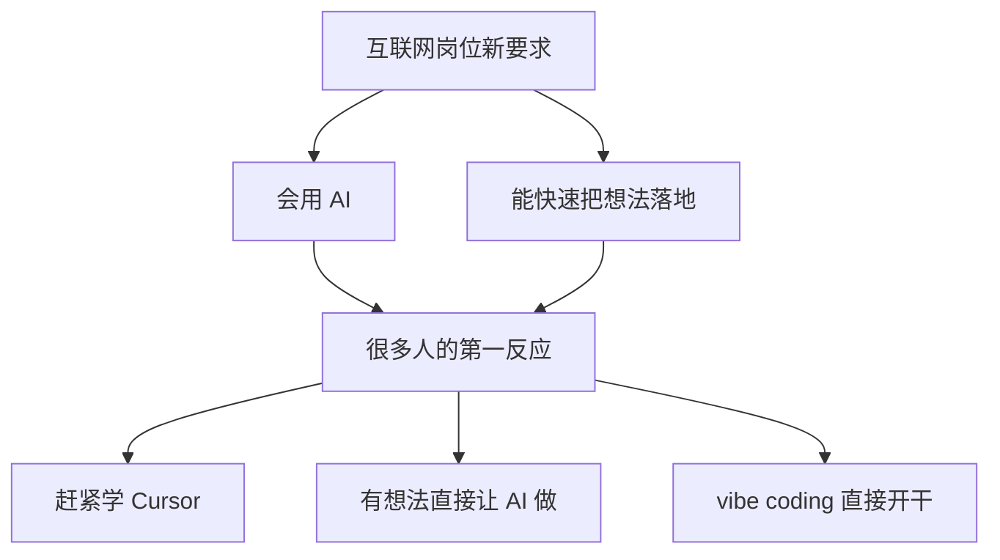
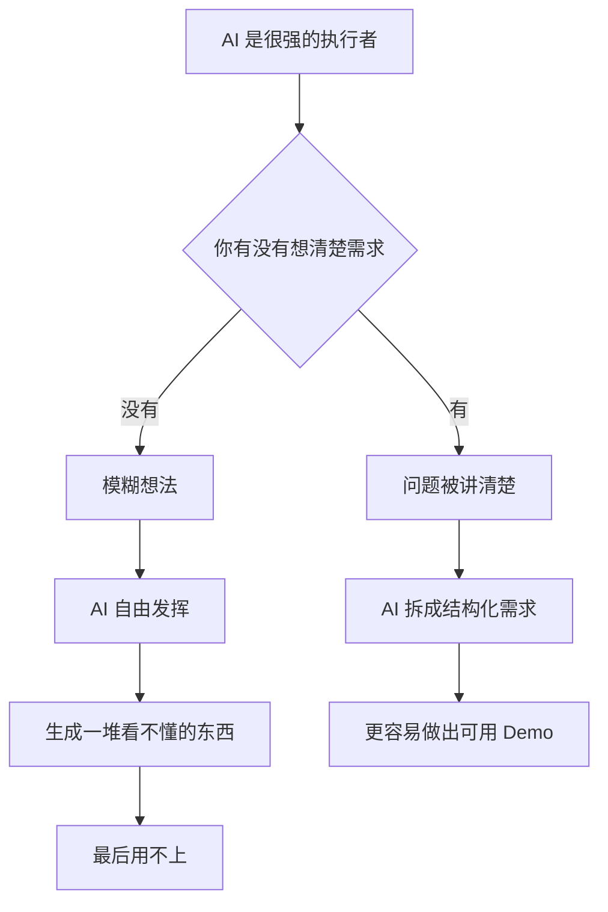
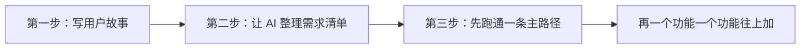
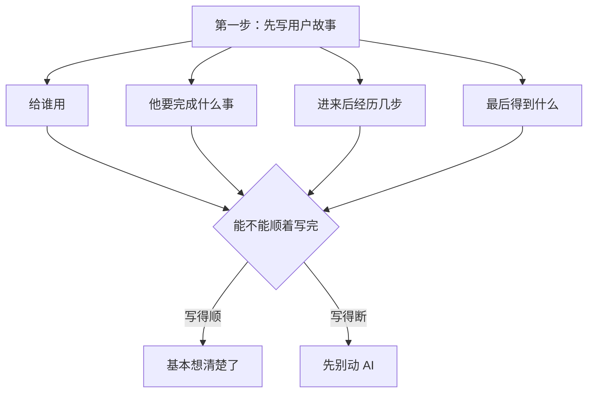
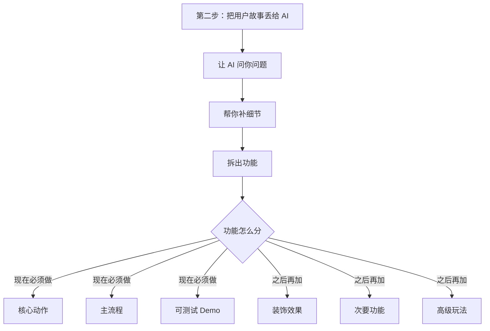
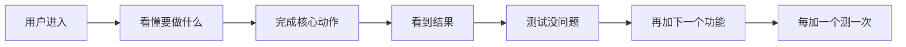
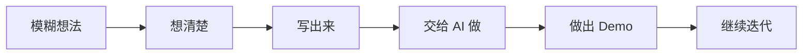

# 《先把想法想清楚再让 AI 做》Excalidraw 演示画布手册

> 配套脚本：`脚本_V1.md`  
> 推荐用法：优先使用 Excalidraw 的「文字至图表 AI Beta」，生成不满意时再切到「Mermaid」兜底。  
> 画布目标：把这条口播里的抽象观点，变成一张可以边讲边缩放的横向长画布。

---

## 0. 总体工作流

### Excalidraw 操作方式

1. 打开 Excalidraw。
2. 点击「文字至图表 AI Beta」。
3. 复制下面每一段「AI 生成 Prompt」。
4. 生成图后插入画布。
5. 从左到右排成一张长画布。
6. 用 CleanShot 录屏，头像窗口放右下角，讲到哪里就缩放到哪里。

### 推荐画布顺序

```text
01 开场现实变化
02 错误路径：有想法直接开干
03 核心原因：AI 不替你想需求
04 方法总图：先想清楚 3 步
04-1 第一步：写用户故事
04-2 第二步：让 AI 整理需求清单
04-3 第三步：跑通主路径
05 结尾总结：规划能力
```

如果时间紧，只做 `01`、`02`、`03`、`04`、`05` 五张图就够用。

---

## 01 开场：岗位要求变了

对应脚本：

> 最近看互联网岗位招聘，越来越多的要求里开始写一条：会用 AI，能快速把想法落地。

### AI 生成 Prompt

```text
请生成一个简洁的流程图，手绘风格，适合短视频录屏讲解。

主题：互联网岗位要求正在变化。

图表从上到下展示：
1. 互联网岗位新要求
2. 会用 AI
3. 能快速把想法落地
4. 很多人的第一反应
5. 赶紧学 Cursor
6. 有想法直接让 AI 做
7. vibe coding 直接开干

请把“互联网岗位新要求”作为顶部主标题。
请把“会用 AI”和“能快速把想法落地”并列展示。
请把“很多人的第一反应”放在中间，下面分出 3 个反应节点。
整体画面要清爽，不要太复杂，留出空白，适合后续用鼠标逐个指向讲解。
```

### Mermaid 兜底



### 生成后微调

- 放大 `互联网岗位新要求`。
- `会用 AI` 和 `能快速把想法落地` 用同一种颜色。
- `赶紧学 Cursor / 有想法直接让 AI 做 / vibe coding 直接开干` 用浅黄色，表现“看起来合理，但其实会踩坑”。

### 录制走位

1. 画面先停在 `互联网岗位新要求`。
2. 鼠标依次指向 `会用 AI` 和 `能快速把想法落地`。
3. 讲到“第一反应”时，鼠标移动到下面三个节点。
4. 讲到“但我自己踩过一个坑”时，平移到下一张图。

---

## 02 错误路径：有想法直接开干

对应脚本：

> 第一次做的时候，我就犯了一个错：有了想法，直接打开 AI 开干。

### AI 生成 Prompt

```text
请生成一个横向流程图，手绘风格，适合短视频录屏讲解。

主题：有想法直接让 AI 做，结果越做越乱。

节点从左到右依次是：
1. 有个想法
2. 直接打开 AI
3. AI 开始生成
4. 一开始挺顺
5. 改这里
6. 那里出 bug
7. 改那里
8. 这里又跑偏
9. 最后推倒重来

请把前四个节点画得比较顺畅。
从“改这里”开始，让流程看起来越来越混乱。
请突出最后一个节点“最后推倒重来”，让它像一个警示结果。
请在图上方加一句大标题：想法没想清楚，AI 只会更快做出错的东西。
整体不要太花，重点是让观众一眼看懂“越改越乱”。
```

### Mermaid 兜底


### 生成后微调

- `最后推倒重来` 放大，改成红色或橙色。
- 如果生成结果太规整，手动拖一下后半段箭头，让它显得更乱。
- 在图旁边加小字：`问题不是 AI 不够强，而是输入太模糊`。

### 录制走位

1. 鼠标从 `有个想法` 沿箭头走到 `一开始挺顺`。
2. 讲“越做越乱”时，快速扫过后半段。
3. 讲“最后推倒重来”时，用 CleanShot 局部放大最后节点。

---

## 03 核心原因：AI 不替你想需求

对应脚本：

> AI 是非常强的执行者，但它不会替你想清楚需求。

### AI 生成 Prompt

```text
请生成一个对比型流程图，手绘风格，适合短视频录屏讲解。

主题：AI 是执行者，但不会替你想清楚需求。

顶部放一个主标题：
AI 是很强的执行者

中间放一个判断节点：
你有没有想清楚需求？

左侧分支是“没有想清楚”：
1. 模糊想法
2. AI 自由发挥
3. 生成一堆看不懂的东西
4. 最后用不上

右侧分支是“想清楚了”：
1. 问题被讲清楚
2. AI 拆成结构化需求
3. 更容易做出可用 Demo

请把左侧分支做成警示感，右侧分支做成清晰、可执行的感觉。
请在底部加一句总结：核心不是会写代码，而是能把问题讲清楚。
```

### Mermaid 兜底



### 生成后微调

- 左边用浅红色，右边用浅绿色。
- `核心不是会写代码，而是能把问题讲清楚` 放大，作为这一屏的记忆点。
- 如果节点太多，可以删掉左侧的 `模糊想法`，保留 `AI 自由发挥` 到 `最后用不上`。

### 录制走位

1. 讲“AI 是执行者”时，放大顶部标题。
2. 讲“你没想清楚，它就自由发挥”时，鼠标走左侧。
3. 讲“能把问题讲清楚”时，鼠标走右侧。
4. 讲“第二次做活动页”时，平移到方法区。

---

## 04 方法总图：先想清楚 3 步

对应脚本：

> 所以我现在固定用 3 步，在让 AI 做之前，先把想法想清楚。

### AI 生成 Prompt

```text
请生成一个横向三步流程图，手绘风格，适合短视频录屏讲解。

主题：让 AI 做之前，先把想法想清楚。

流程从左到右：
1. 第一步：写用户故事
2. 第二步：让 AI 整理需求清单
3. 第三步：先跑通一条主路径
4. 再一个功能一个功能往上加

请把前三步做成三个明显的大卡片。
第一步代表“自己先想”，第二步代表“AI 帮忙结构化”，第三步代表“先跑通核心流程”。
最后一个节点“再一个功能一个功能往上加”作为落点。
画面要干净，适合我讲到每一步时逐个放大。
```

### Mermaid 兜底



### 生成后微调

- 第一步用浅黄，第二步用浅蓝，第三步用浅绿。
- 三个步骤之间留大一点空隙，方便录屏时局部放大。
- 这张图放在方法区最上方，下面再放三张细节图。

### 录制走位

1. 先给观众看完整三步。
2. 讲每一步时，分别放大 `04-1`、`04-2`、`04-3`。

---

## 04-1 第一步：写用户故事

对应脚本：

> 这个东西给谁用、他要完成什么事、进来之后要经历几个步骤、最后能得到什么。

### AI 生成 Prompt

```text
请生成一个从中心向外发散的流程图，手绘风格，适合短视频录屏讲解。

中心主题：
第一步：先写用户故事

围绕中心放 4 个问题：
1. 给谁用？
2. 他要完成什么事？
3. 进来后经历几步？
4. 最后得到什么？

四个问题之后汇总到一个判断：
能不能顺着写完？

判断分成两个结果：
1. 写得顺：基本想清楚了
2. 写得断：先别动 AI

请突出“先别动 AI”这个结果，让它像一个提醒。
请在旁边加一句小字：先用白话写，不急着开工具。
```

### Mermaid 兜底



### 生成后微调

- `先别动 AI` 用红色。
- `基本想清楚了` 用绿色。
- 四个问题尽量摆成四角，录制时鼠标可以逐个点。

### 录制走位

1. 鼠标依次点 4 个问题。
2. 讲“写得顺”时指向绿色结果。
3. 讲“写得断断续续”时指向红色结果。

---

## 04-2 第二步：让 AI 整理需求清单

对应脚本：

> 把这段话丢给 AI，让它帮你整理成结构化的需求清单。

### AI 生成 Prompt

```text
请生成一个流程图，手绘风格，适合短视频录屏讲解。

主题：第二步，让 AI 帮你整理成结构化需求清单。

流程上半部分：
1. 把用户故事丢给 AI
2. 让 AI 问你问题
3. 帮你补细节
4. 拆出功能

然后进入一个分叉：
功能怎么分？

左侧分支：现在必须做
- 核心动作
- 主流程
- 可测试 Demo

右侧分支：之后再加
- 装饰效果
- 次要功能
- 高级玩法

请让“现在必须做”看起来更突出，让“之后再加”看起来像可以暂缓。
请在图旁边加一句提示：不用自己写 PRD，先让 AI 帮你把话问清楚。
```

### Mermaid 兜底



### 生成后微调

- `现在必须做` 相关节点用绿色。
- `之后再加` 相关节点用灰色或浅蓝。
- 如果画面太满，删掉 `高级玩法`，保留两个暂缓项就够。

### 录制走位

1. 讲“问你问题、补细节、拆功能”时，鼠标沿上半部分走。
2. 讲“哪些核心要做，哪些之后加”时，在分叉处停一下。
3. 强调 `核心动作`、`主流程`、`可测试 Demo`。

---

## 04-3 第三步：跑通主路径

对应脚本：

> 第一版不追求完整，只做用户从进来到完成核心动作这一条线。

### AI 生成 Prompt

```text
请生成一个横向主路径流程图，手绘风格，适合短视频录屏讲解。

主题：第三步，先跑通一条主路径。

主路径从左到右：
1. 用户进入
2. 看懂要做什么
3. 完成核心动作
4. 看到结果
5. 测试没问题
6. 再加下一个功能
7. 每加一个测一次

请把“用户进入”到“看到结果”画成一条清晰的主线。
请把“完成核心动作”突出显示，因为这是第一版最重要的目标。
请在图上方加一句大标题：先跑通，再往上加。
整体画面要像一条可执行的路径，不要像复杂项目管理图。
```

### Mermaid 兜底



### 生成后微调

- `用户进入` 到 `看到结果` 统一用绿色。
- `完成核心动作` 放大。
- `每加一个测一次` 做成最后的习惯提醒。

### 录制走位

1. 鼠标按箭头从左到右走一遍。
2. 讲“第一版不追求完整”时，停在 `完成核心动作`。
3. 讲“每加一个测一次”时，放大最后两个节点。

---

## 05 结尾总结：AI 放大规划能力

对应脚本：

> AI 放大的不是代码能力，是你的规划能力。

### AI 生成 Prompt

```text
请生成一个简洁的收尾流程图，手绘风格，适合短视频最后停留。

主题：AI 放大的不是代码能力，是规划能力。

请在顶部放一句大标题：
AI 放大的不是代码能力，是你的规划能力

下面放一条从左到右的流程：
1. 模糊想法
2. 想清楚
3. 写出来
4. 交给 AI 做
5. 做出 Demo
6. 继续迭代

请把“模糊想法”画得灰一点。
请把“想清楚”“写出来”“交给 AI 做”作为重点步骤。
整体要简洁、有结束感，适合视频最后停留 2 到 3 秒。
```

### Mermaid 兜底



### 生成后微调

- 顶部大标题一定要最大。
- `模糊想法` 用灰色，后面主路径用统一主色。
- 这张图放在画布最右边，作为收尾定格画面。

### 录制走位

1. 讲“光会提需求不够用了”时，从 `模糊想法` 开始。
2. 讲“不是说你得学写代码”时，不要把镜头重点放在 `做出 Demo`。
3. 讲“规划能力”时，放大顶部标题。
4. 最后一句固定收口时，画面停在总结卡。

---

## 6. 最小可用版

如果你只想先录一版，优先生成这 5 张：

| 顺序 | 画面 | 用途 |
|---|---|---|
| 1 | 01 开场 | 说明岗位要求变化 |
| 2 | 02 错误路径 | 讲清楚踩坑经历 |
| 3 | 03 核心原因 | 给出认知转折 |
| 4 | 04 方法总图 | 给出 3 步方法 |
| 5 | 05 结尾总结 | 收束成记忆点 |

`04-1`、`04-2`、`04-3` 是补充细节。如果视频节奏偏快，可以不单独生成，直接在 `04 方法总图` 上讲完。

---

## 7. 拍摄前检查

- AI 生成的图如果有英文或怪词，手动改成中文。
- 每张图插入后先转成 Excalidraw 元素，不要录 Prompt 输入界面。
- 节点文字要足够大，缩小后还能看清。
- 从左到右排，不要上下跳太多。
- 头像窗口放右下角，别挡住箭头和总结标题。
- CleanShot 开启麦克风、摄像头、鼠标高亮。
- 每张图只做一次重点放大，避免观众晕。
