# 别急着给自己做人设

## 发布信息

| 项目    | 信息                                          |
| ----- | ------------------------------------------- |
| 选题类型  | 人设稿 · 创作复盘 · 李诞《工作手册》读书启发                   |
| 展现形式  | 画布随笔型视频 + 图片素材穿插 + 右下角真人圆形小窗                |
| 预估时长  | 纸面约 5:00-5:40 · 成片约 4:20-5:00               |
| 建议发布日 | 放在 1-2 条方法论内容之后穿插发布，不建议紧接选题 25              |
| 核心观点  | 互联网人做自媒体，别太早把自己当账号运营；人设不是设计出来的，是持续真实表达后长出来的 |

---

## 封面 / 标题 / 标签

### 小红书版

**封面文案**：「别把自己 / 做成账号」

**短视频主标题**（≤20字）：别急着给自己做人设

**话题标签**：`#自媒体` `#个人成长` `#内容创作` `#读书笔记`

### 抖音版

**封面文案**：「别把自己 / 做成账号」

**短视频主标题**：互联网人做自媒体，最容易犯这个错

**话题标签**：`#自媒体` `#个人成长` `#内容创作` `#读书`

**抖音审核风险自检**：无裁员 / 岗位替代 / 就业焦虑词；无敏感社会热点；题材为个人创作复盘，风险低。

---

## 封面设计方案

**拍摄指南**：

- 表情：皱眉思考，不要太严肃，像刚把一件事想明白
- 动作：一只手托下巴，另一只手指向旁边的画布或便签
- 视线：看向镜头或微微看向画布方向
- 构图：人物偏右，左侧留出大面积文字区；背景可以是书桌、电脑、读书笔记

**文字排版示意**：

- 第一行「别把自己」：白色加粗，中号
- 第二行「做成账号」：亮黄色大号，加黑色描边

**即梦 AI 提示词**：

> 我要做一张短视频封面，写实人像，画面右侧是一位穿着日常休闲上衣的年轻亚洲男性，坐在书桌前，旁边有电脑、便签纸、一本打开的书。他一只手托下巴，眉头微皱，像在认真复盘自己做自媒体时踩过的坑。背景有一点画布和笔记元素，整体真实、安静、有思考感，不要商务海报感，不要夸张科技感。画面左侧留出大面积文字区。文案是「别把自己 / 做成账号」，文字排版：第一行「别把自己」用白色加粗，第二行「做成账号」用亮黄色大号字加黑色描边，整体清晰适合手机小屏。

**醒图/剪映加字步骤**：

1. 导入封面图，先裁成 9:16。
2. 左侧加第一行「别把自己」，白色粗体，中号。
3. 第二行加「做成账号」，亮黄色粗体，大号，黑色描边。
4. 检查缩略图，确保“做成账号”一眼能看清。

---

## 脚本正文（含剪辑标注）

> 标注说明：
>
> - ✂️ = 跳剪点
> - 🔤 = 花字（大号文字压屏）
> - 🖼️ = 图片 / 截图素材
> - 📌 = 画布当前显示内容
> - 🎙️ = 右下角真人圆形小窗旁白

---

### ⏱ 开场钩子（约 20 秒）

互联网人做自媒体，很容易犯一个错。

不是不会做内容，而是太早把自己当成一个账号来运营。

这句话什么意思，就是说还没真正开始表达，就先想清楚账号定位、人设、对标账号、封面、选题、发布时间等等。

这些都不是错。

但如果一开始想这些，创作会慢慢变成上班。

> 📌 画布显示：中心大字「太早把自己当账号运营」
>
> 周围散开关键词：账号定位 / 人设 / 对标账号 / 选题 / 封面 / 发布时间 / 数据
>
> 🎙️ 右下角真人圆形小窗出现，占画面 12%-15%

---

### ⏱ 我的真实状态（约 55 秒）

我之前就是这样。

我在互联网做了 8 年，习惯了先做规划、拆目标、找关键动作、看数据。

所以我做自媒体之前，也花了很长时间去想：我到底要做一个什么账号？我应该给别人留下什么印象？我的人设是什么？我该讲什么选题？封面怎么设计？标题怎么写吸引人？

甚至真正开始做之前，我已经把账号规划、内容方向、栏目、发布节奏都想过一遍。

听起来很专业。

但这里有个问题。

你会越来越像在运营一个产品，而不是在表达一个真实的人。

> 📌 画布左侧：一个人站在中间
>
> 周围是几张卡片：
>
> - 账号定位
> - 人设标签
> - 选题池
> - 标题封面
> - 数据复盘
>
> 🖼️ 穿插素材：可放你自己的选题池 / 封面稿 / 数据表局部截图，注意打码

---

### ⏱ 数据焦虑：每条内容都变成一次 KPI（约 55 秒）

这种状态继续往下走，就会变成数据焦虑。

一条视频发出去，播放高了，就觉得这个方向对。

播放低了，就开始怀疑：是不是选题不行？是不是封面不行？是不是发布时间不对？是不是我这个人就不适合做自媒体？

你会把每一条内容都当成一次测试。

测试本身没问题，我现在也会看完播率、点赞量、收藏量等等，也会复盘封面和开头。

但《李诞工作手册》这本书里有个说法提醒了我：如果一个人做自媒体，焦虑到生活体验都变差了，那他怎么做出好内容？

这句话我挺有感触。

数据要看，但数据不能决定你今天还想不想表达。

> 📌 画布新增一块「数据焦虑」
>
> 左边写：播放 / 点赞量 / 收藏量 / 完播率 / 涨粉
>
> 右边写：开心一天 / 怀疑自己 / 改选题 / 改封面 / 再怀疑自己
>
> 🔤 花字：「数据是反馈，不是主人」

---

### ⏱ 起号心态：创作变成打工（约 55 秒）

李诞在书里讲自媒体，有句话我觉得很准：不要只用起号的心态做内容。

因为一旦只剩起号，你就会把这件事当活干。

不是说不能认真做。

认真做当然重要。

但如果每天想的都是“我要怎么涨粉”“我要怎么打造人设”“我要怎么做出爆款”，时间久了，人会很累。

更麻烦的是，你会慢慢忘了自己一开始为什么想表达。

你本来是想分享一点真实经历，后来变成每天都在问：这条视频拍出来能不能火？

> 📌 画布显示一个对比：
>
> 左侧：分享心态
>
> - 我最近真的有感触
> - 这件事可能对别人有用
> - 我想把它说清楚
>
> 右侧：起号心态
>
> - 这条能不能涨粉
> - 这个人设稳不稳
> - 这个结构像不像爆款

---

### ⏱ AI 放大了这个问题（约 60 秒）

现在 AI 又把这件事放大了一层。

因为 AI 确实能帮你拆爆款。

它能分析选题，能写标题，能改开头，也能把一条内容整理成一条爆款视频。

我自己也用 AI。

但我越来越觉得，AI 越会写爆款，人越不能只剩爆款结构。

因为爆款结构会越来越便宜。

真正难的是那些说不清楚的东西。

比如你为什么会被一句话打中。

你为什么会在做账号的时候别扭。

你为什么明知道要看数据，但还是会被数据影响心情。

你为什么一边想真实表达，一边又忍不住想设计一个更容易被关注的自己。

这些东西，AI 可以模仿，但它没有你的经历。

它没有你的羞耻、纠结、不甘心，也没有你那些不太完美但很真实的反应。

> 📌 画布显示：左侧「AI 会的」
>
> - 拆爆款
> - 写标题
> - 改开头
> - 模仿结构
>
> 右侧「人要留下的」
>
> - 真实经历
> - 别扭
> - 犹豫
> - 羞耻
> - 不完美
>
> 🔤 花字：「AI 越会写爆款，人越要真实」

---

### ⏱ 人设不是设计出来的（约 70 秒）

所以我现在对“人设”这件事的想法，也有点变了。

以前我总觉得，做自媒体第一步是先想清楚人设。

我要在平台上让别人觉得我是一个什么样的人。

但现在我觉得，这个顺序可能反了。

你不是先设计一个人设，然后按照它去表演。

你是先持续真实地表达。

讲你真的关心的事。

暴露你真实的判断、犹豫、别扭和选择。

时间长了，别人自然会形成一个印象，而那个印象，才是你的人设。

它不是编出来的，是长出来的。

李诞直播那么多小时，如果他只靠人设，而不是真诚回答，观众其实早就能感觉出来。

做内容也是一样。

你是什么样，就先是什么样，别一上来就急着演成另外一个人。

> 📌 画布显示核心句：
>
> 「人设不是设计出来的，是长出来的」
>
> 下方流程：
>
> 持续真实表达 → 观众形成印象 → 这才是风格
>
> 🖼️ 可穿插：《李诞工作手册》书封 / 读书页局部 / 你自己的读书笔记截图

---

### ⏱ 对标账号：别太迷信成功经验（约 55 秒）

还有一个很容易让互联网人上头的东西，叫对标账号。

找对标账号当然有用。

你可以看别人的标题、封面、脚本结构、发布时间。

但不能太迷信。

因为很多成功经验，都是事后总结的。

对方可能是真诚的，但他自己真正成功的原因，可能他也说不清楚。

你学他的发布时间、选题结构、变现节点，可能学到的只是表面动作。

真正值得看的，反而是更底层的东西。

他是不是真的长期在讲自己关心的话题。

他是不是真的持续给别人提供价值。

他是不是在做一个他愿意做很久的东西。

> 📌 画布显示：
>
> 「可以看对标，但不要迷信对标」
>
> 左侧：表面动作
>
> - 标题
> - 封面
> - 发布时间
> - 变现节点
>
> 右侧：更底层的东西
>
> - 长期关心什么
> - 持续分享什么
> - 真实状态是什么

---

### ⏱ 段永平那句话（约 35 秒）

段永平说过一句话：你最终一定会成为你本该成为的人。

我现在对这句话的理解是，风格不是规划出来的。

它是你一次次选择之后留下来的痕迹。

你长期选择讲什么，选择怎么说，选择在什么事情上认真，选择在什么事情上不装。

最后别人看到的那个你，就是你的风格。

所以。做自媒体当然要运营，但不能让运营心态把表达欲覆盖掉。

> 📌 画布显示一条时间线：
>
> 一次表达 → 一次选择 → 一次复盘 → 一次更新 → 慢慢形成风格

---

### ⏱ 结尾收束（约 30 秒）

这也是我最近读《李诞工作手册》这本书最大的感受。

做自媒体，不是完全不要方法。

选题、封面、结构、数据，这些都要学。

但它们是术。

如果一个创作者最后只剩下术，就很容易变成一台内容机器。

真正能让你长期做下去的，是你还有没有真实兴趣，还有没有分享欲，还愿不愿意承认自己没那么完美。

人设不是设计出来的，是你持续真实表达之后，别人慢慢看见的那个你。

今天就讲这些，也希望对你有所帮助，我是张半蛋，我们下期再见，拜拜。

> 📌 画布最终停留：
>
> 「别急着成为一个账号，先成为一个真实的人」

---

## 抖音版开头钩子（正片前加，约 4 秒）

> 在正片前加这段，小红书版不加

互联网人做自媒体，最容易犯的错，不是不会运营，是太早把自己当成账号。→ 接正片开头

---

## 脚本文案（纯文案版，供拍摄参考）

互联网人做自媒体，很容易犯一个错。不是不会做内容，而是太早把自己当成一个账号来运营。这句话什么意思，就是说还没真正开始表达，就先想清楚账号定位、人设、对标账号、封面、选题、发布时间等等。这些都不是错。但如果一开始想这些，创作会慢慢变成上班。

我之前就是这样。我在互联网做了 8 年，习惯了先做规划、拆目标、找关键动作、看数据。所以我做自媒体之前，也花了很长时间去想：我到底要做一个什么账号？我应该给别人留下什么印象？我的人设是什么？我该讲什么选题？封面怎么设计？标题怎么写吸引人？甚至真正开始做之前，我已经把账号规划、内容方向、栏目、发布节奏都想过一遍。

听起来很专业。但这里有个问题。你会越来越像在运营一个产品，而不是在表达一个真实的人。

这种状态继续往下走，就会变成数据焦虑。一条视频发出去，播放高了，就觉得这个方向对。播放低了，就开始怀疑：是不是选题不行？是不是封面不行？是不是发布时间不对？是不是我这个人就不适合做自媒体？你会把每一条内容都当成一次测试。测试本身没问题，我现在也会看完播率、点赞量、收藏量等等，也会复盘封面和开头。

但《李诞工作手册》这本书里有个说法提醒了我：如果一个人做自媒体，焦虑到生活体验都变差了，那他怎么做出好内容？

这句话我挺有感触。数据要看，但数据不能决定你今天还想不想表达。

李诞在书里讲自媒体，有句话我觉得很准：不要只用起号的心态做内容。因为一旦只剩起号，你就会把这件事当活干。不是说不能认真做，认真做当然重要，但如果每天想的都是“我要怎么涨粉”“我要怎么打造人设”“我要怎么做出爆款”，时间久了，人会很累。更麻烦的是，你会慢慢忘了自己一开始为什么想表达，你本来是想分享一点真实经历，后来变成每天都在问：这条视频拍出来能不能火？

现在 AI 又把这件事放大了一层。因为 AI 确实能帮你拆爆款。它能分析选题，能写标题，能改开头，也能把一条内容整理成一条爆款视频。我自己也用 AI。但我越来越觉得，AI 越会写爆款，人越不能只剩爆款结构。因为爆款结构会越来越便宜。真正难的是那些说不清楚的东西。比如你为什么会被一句话打中，你为什么会在做账号的时候别扭，你为什么明知道要看数据，但还是会被数据影响心情。你为什么一边想真实表达，一边又忍不住想设计一个更容易被关注的自己。这些东西，AI 可以模仿，但它没有你的经历。它没有你的羞耻、纠结、不甘心，也没有你那些不太完美但很真实的反应。

所以我现在对“人设”这件事的想法，也有点变了。

以前我总觉得，做自媒体第一步是先想清楚人设。我要在平台上让别人觉得我是一个什么样的人。但现在我觉得，这个顺序可能反了。你不是先设计一个人设，然后按照它去表演。你是先持续真实地表达。讲你真的关心的事。暴露你真实的判断、犹豫、别扭和选择。时间长了，别人自然会形成一个印象，而那个印象，才是你的人设。它不是编出来的，是长出来的。李诞直播那么多小时，如果他只靠人设，而不是真诚回答，观众其实早就能感觉出来。做内容也是一样。你是什么样，就先是什么样，别一上来就急着演成另外一个人。

还有一个很容易让互联网人上头的东西，叫对标账号。找对标账号当然有用。你可以看别人的标题、封面、脚本结构、发布时间。但不能太迷信。因为很多成功经验，都是事后总结的。对方可能是真诚的，但他自己真正成功的原因，可能他也说不清楚。你学他的发布时间、选题结构、变现节点，可能学到的只是表面动作。真正值得看的，反而是更底层的东西。他是不是真的长期在讲自己关心的话题。他是不是真的持续给别人提供价值。他是不是在做一个他愿意做很久的东西。

段永平说过一句话：你最终一定会成为你本该成为的人。我现在对这句话的理解是，风格不是规划出来的。它是你一次次选择之后留下来的痕迹。你长期选择讲什么，选择怎么说，选择在什么事情上认真，选择在什么事情上不装。最后别人看到的那个你，就是你的风格。

所以。做自媒体当然要运营，但不能让运营心态把表达欲覆盖掉。这也是我最近读《李诞工作手册》这本书最大的感受。做自媒体，不是完全不要方法。选题、封面、结构、数据，这些都要学。但它们是术。如果一个创作者最后只剩下术，就很容易变成一台内容机器。真正能让你长期做下去的，是你还有没有真实兴趣，还有没有分享欲，还愿不愿意承认自己没那么完美。

人设不是设计出来的，是你持续真实表达之后，别人慢慢看见的那个你。今天就讲这些，也希望对你有所帮助，我是张半蛋，我们下期再见，拜拜。

---

## 脚本文案（剪映拍摄剪辑版）

互联网人做自媒体，很容易犯一个错。不是不会做内容，而是太早把自己当成一个账号来运营。这句话什么意思，就是说还没真正开始表达，就先想清楚账号定位、人设、对标账号、封面、选题、发布时间等等。这些都不是错。但如果一开始想这些，创作会慢慢变成上班。

我之前就是这样。我在互联网做了 8 年，习惯了先做规划、拆目标、找关键动作、看数据。所以我做自媒体之前，也花了很长时间去想：我到底要做一个什么账号？我应该给别人留下什么印象？我的人设是什么？我该讲什么选题？封面怎么设计？标题怎么写吸引人？甚至真正开始做之前，我已经把账号规划、内容方向、栏目、发布节奏都想过一遍。

听起来很专业。但这里有个问题。你会越来越像在运营一个产品，而不是在表达一个真实的人。

这种状态继续往下走，就会变成数据焦虑。一条视频发出去，播放高了，就觉得这个方向对。播放低了，就开始怀疑：是不是选题不行？是不是封面不行？是不是发布时间不对？是不是我这个人就不适合做自媒体？你会把每一条内容都当成一次测试。测试本身没问题，我现在也会看完播率、点赞量、收藏量等等，也会复盘封面和开头。

但《李诞工作手册》这本书里有个说法提醒了我：如果一个人做自媒体，焦虑到生活体验都变差了，那他怎么做出好内容？

这句话我挺有感触。数据要看，但数据不能决定你今天还想不想表达。

李诞在书里讲自媒体，有句话我觉得很准：不要只用起号的心态做内容。因为一旦只剩起号，你就会把这件事当活干。不是说不能认真做，认真做当然重要，但如果每天想的都是“我要怎么涨粉”“我要怎么打造人设”“我要怎么做出爆款”，时间久了，人会很累。更麻烦的是，你会慢慢忘了自己一开始为什么想表达，你本来是想分享一点真实经历，后来变成每天都在问：这条视频拍出来能不能火？

现在 AI 又把这件事放大了一层。因为 AI 确实能帮你拆爆款。它能分析选题，能写标题，能改开头，也能把一条内容整理成一条爆款视频。我自己也用 AI。但我越来越觉得，AI 越会写爆款，人越不能只剩爆款结构。因为爆款结构会越来越便宜。真正难的是那些说不清楚的东西。

比如你为什么会被一句话打中，你为什么会在做账号的时候别扭，你为什么明知道要看数据，但还是会被数据影响心情。你为什么一边想真实表达，一边又忍不住想设计一个更容易被关注的自己。这些东西，AI 可以模仿，但它没有你的经历。它没有你的羞耻、纠结、不甘心，也没有你那些不太完美但很真实的反应。

所以我现在对“人设”这件事的想法，也有点变了。

以前我总觉得，做自媒体第一步是先想清楚人设。我要在平台上让别人觉得我是一个什么样的人。但现在我觉得，这个顺序可能反了。你不是先设计一个人设，然后按照它去表演。你是先持续真实地表达。讲你真的关心的事。暴露你真实的判断、犹豫、别扭和选择。时间长了，别人自然会形成一个印象，而那个印象，才是你的人设。它不是编出来的，是长出来的。李诞直播那么多小时，如果他只靠人设，而不是真诚回答，观众其实早就能感觉出来。做内容也是一样。你是什么样，就先是什么样，别一上来就急着演成另外一个人。

还有一个很容易让互联网人上头的东西，叫对标账号。找对标账号当然有用。你可以看别人的标题、封面、脚本结构、发布时间。但不能太迷信。因为很多成功经验，都是事后总结的。对方可能是真诚的，但他自己真正成功的原因，可能他也说不清楚。你学他的发布时间、选题结构、变现节点，可能学到的只是表面动作。真正值得看的，反而是更底层的东西。他是不是真的长期在讲自己关心的话题。他是不是真的持续给别人提供价值。他是不是在做一个他愿意做很久的东西。

段永平说过一句话：你最终一定会成为你本该成为的人。我现在对这句话的理解是，风格不是规划出来的。它是你一次次选择之后留下来的痕迹。你长期选择讲什么，选择怎么说，选择在什么事情上认真，选择在什么事情上不装。最后别人看到的那个你，就是你的风格。

所以。做自媒体当然要运营，但不能让运营心态把表达欲覆盖掉。这也是我最近读《李诞工作手册》这本书最大的感受。做自媒体，不是完全不要方法。选题、封面、结构、数据，这些都要学。但它们是术。如果一个创作者最后只剩下术，就很容易变成一台内容机器。真正能让你长期做下去的，是你还有没有真实兴趣，还有没有分享欲，还愿不愿意承认自己没那么完美。

人设不是设计出来的，是你持续真实表达之后，别人慢慢看见的那个你。今天就讲这些，也希望对你有所帮助，我是张半蛋，我们下期再见，拜拜。

---

## 演示画布设计稿（发给 AI 生成画布用）

别把所有信息塞进一张大流程图。这个主题更适合做成「竖屏读书笔记式信息图」：一屏一个判断，节点少一点，字号大一点，留白多一点，右下角给真人圆形小窗留位置。

### Excalidraw AI 美化版提示词

请帮我生成一个 9:16 竖屏 Excalidraw 演示画布，用在口播视频里。整体像「手写读书笔记 + 自媒体复盘草稿」，不要商务 PPT，不要复杂流程图，不要密密麻麻的小框。

画布要求：

- 尺寸比例：9:16，内容居中，右下角预留一个 12%-15% 的圆形真人头像小窗
- 背景：浅米色或暖白色，有一点纸张质感
- 主色：深灰文字 + 暖黄色重点 + 浅蓝色辅助 + 少量红色提醒
- 字体感觉：手写感、便签感，但要清楚，适合手机小屏观看
- 布局：从上到下分成 5 个大卡片，每张卡片之间留明显空白，用粗箭头连接
- 重点：大字少、层级清楚，不要超过 20 个小节点

第一屏：标题区

- 大标题：别急着给自己做人设
- 副标题：互联网人做自媒体，别太早把自己当账号运营
- 视觉：标题像写在一张大便签上，旁边画一个简单的小人，表情有点纠结

第二屏：问题是怎么开始的

- 卡片标题：还没开始表达，先把自己当产品规划了一遍
- 中心画一个普通人小人
- 周围只放 5 张小便签：账号定位 / 人设 / 对标账号 / 选题 / 数据
- 底部小字：看起来很专业，但人会越来越像一个项目

第三屏：越做越拧巴

- 左侧卡片：数据焦虑
  - 播放高：觉得方向对
  - 播放低：怀疑自己
- 右侧卡片：起号心态
  - 能不能火
  - 人设稳不稳
  - 像不像爆款
- 中间用红色小箭头连接，旁边写：创作慢慢变成打工
- 这一屏可以有一点凌乱感，但文字不能密

第四屏：AI 把问题放大

- 左侧标题：AI 会的
  - 拆爆款
  - 写标题
  - 改开头
  - 模仿结构
- 右侧标题：人要留下的
  - 真实经历
  - 别扭
  - 犹豫
  - 不完美
- 中间大字：AI 越会写爆款，人越要真实

第五屏：最终结论

- 大字：人设不是设计出来的，是长出来的
- 下方用一条干净的横向流程：
  - 持续真实表达 → 观众形成印象 → 慢慢变成风格
- 最底部收口大字：
  - 别急着成为一个账号
  - 先成为一个真实的人

画面风格补充：

- 每个大卡片用圆角矩形，不要硬边框
- 小便签可以轻微倾斜，像真实贴上去的
- 箭头用手绘粗箭头，少用细线
- 重要句子用暖黄色底色高亮
- 不要画太多人物、图标和装饰，保证手机上能看清

### Mermaid 美化版提示词

如果要在「美人鱼 / Mermaid」里生成，直接用下面这版。结构保留 `graph TD + subgraph`，但节点做了压缩，样式也做了区分，生成出来会比纯文字流程图更清楚。

```mermaid
graph TD
    Start["别急着给自己做人设"] --> A["互联网人做自媒体<br/>最容易太早把自己当账号运营"]

    subgraph A1["第一部分：互联网人的惯性"]
        A --> B1["账号定位"]
        A --> B2["人设"]
        A --> B3["对标账号"]
        A --> B4["选题"]
        A --> B5["数据"]
        B1 --> C["还没开始表达<br/>先把自己当产品规划了一遍"]
        B2 --> C
        B3 --> C
        B4 --> C
        B5 --> C
    end

    C --> D["数据焦虑"]

    subgraph D1["第二部分：数据焦虑"]
        D --> D2["播放高<br/>觉得方向对"]
        D --> D3["播放低<br/>怀疑自己"]
        D2 --> D4["反复改选题<br/>改封面 / 改发布时间"]
        D3 --> D4
        D4 --> E["数据是反馈<br/>不是主人"]
    end

    E --> F["起号心态"]

    subgraph F1["第三部分：起号心态"]
        F --> F2["这条能不能火"]
        F --> F3["人设稳不稳"]
        F --> F4["结构像不像爆款"]
        F2 --> G["只剩起号<br/>创作就会变成打工"]
        F3 --> G
        F4 --> G
    end

    G --> H["AI 把问题放大"]

    subgraph H1["第四部分：AI 和人的区别"]
        H --> I1["AI 会的<br/>拆爆款 / 写标题 / 改开头 / 模仿结构"]
        H --> I2["人要留下的<br/>真实经历 / 别扭 / 犹豫 / 不完美"]
        I1 --> J["AI 越会写爆款<br/>人越要真实"]
        I2 --> J
    end

    J --> L["对标账号"]

    subgraph L1["第五部分：对标账号"]
        L --> L2["表面动作<br/>标题 / 封面 / 发布时间 / 变现节点"]
        L --> L3["更底层的东西<br/>长期关心什么 / 持续分享什么 / 真实状态是什么"]
        L2 --> L4["可以看对标<br/>但不要迷信对标"]
        L3 --> L4
    end

    L4 --> M["风格不是规划出来的"]

    subgraph M1["第六部分：段永平那句话"]
        M --> M2["一次表达"]
        M2 --> M3["一次选择"]
        M3 --> M4["一次复盘"]
        M4 --> M5["一次更新"]
        M5 --> N["慢慢形成风格"]
    end

    N --> K["人设不是设计出来的<br/>是长出来的"]

    subgraph K1["第七部分：人设怎么形成"]
        K --> K2["持续真实表达"]
        K2 --> K3["观众形成印象"]
        K3 --> K4["慢慢变成风格"]
        K4 --> End["别急着成为一个账号<br/>先成为一个真实的人"]
    end

    classDef title fill:#111827,stroke:#111827,color:#ffffff,stroke-width:2px;
    classDef key fill:#FEF3C7,stroke:#F59E0B,color:#78350F,stroke-width:2px;
    classDef note fill:#FFFBEB,stroke:#FACC15,color:#713F12,stroke-width:1.5px;
    classDef problem fill:#FEF2F2,stroke:#FCA5A5,color:#7F1D1D,stroke-width:1.5px;
    classDef ai fill:#EEF2FF,stroke:#818CF8,color:#312E81,stroke-width:1.5px;
    classDef human fill:#ECFDF5,stroke:#6EE7B7,color:#064E3B,stroke-width:1.5px;
    classDef quote fill:#F1F5F9,stroke:#94A3B8,color:#1E293B,stroke-width:1.5px;
    classDef final fill:#263238,stroke:#111827,color:#ffffff,stroke-width:2px;

    class Start,A title;
    class C,E,G,J,L4,N,K key;
    class B1,B2,B3,B4,B5,D2,D3,D4,F2,F3,F4,L2,L3 note;
    class D,F,H,L problem;
    class I1 ai;
    class I2,K2,K3,K4 human;
    class M,M2,M3,M4,M5 quote;
    class End final;

    style A1 fill:#FFF7ED,stroke:#FDBA74,stroke-width:2px,color:#7C2D12
    style D1 fill:#FEF2F2,stroke:#FCA5A5,stroke-width:2px,color:#7F1D1D
    style F1 fill:#FFF1F2,stroke:#FDA4AF,stroke-width:2px,color:#881337
    style H1 fill:#F5F3FF,stroke:#A78BFA,stroke-width:2px,color:#4C1D95
    style L1 fill:#EFF6FF,stroke:#93C5FD,stroke-width:2px,color:#1E3A8A
    style M1 fill:#F8FAFC,stroke:#CBD5E1,stroke-width:2px,color:#334155
    style K1 fill:#F0FDFA,stroke:#5EEAD4,stroke-width:2px,color:#134E4A
    linkStyle default stroke:#94A3B8,stroke-width:2px;
```

### 生成时的取舍

- 如果是视频画布，优先用 Excalidraw 版，视觉更自然。
- 如果是截图展示，优先用 Mermaid 版，结构更清楚。
- 不建议把 8 个部分全部放进一张流程图，手机上会变成一堆看不清的小框。

---

## 图片 / 截图素材建议

1. 《李诞工作手册》书封或读书页局部
2. `知识库/灵感速记.md` 中这条读书灵感的局部截图
3. 你自己的选题池 / 封面稿 / 数据复盘截图，全部打码
4. AI 生成标题或拆爆款结构的聊天截图，注意别露隐私
5. 一张你录制时的桌面图，保留书、电脑、画布的真实感

---

## 评论区置顶文案（发布后用）

做自媒体时，你最容易卡在哪？

❶ 总想先把人设想清楚
❷ 太在意数据，发完就反复看
❸ 一直找对标，越看越焦虑
❹ 想表达，但总觉得自己还没准备好

扣数字，我看哪个最多，下期就讲那个 👇

---

## 创作备注

- 脚本版本：V1
- 创建日期：2026-05-16
- 素材来源：`知识库/灵感速记.md` 中「李诞工作手册·自媒体创作心法（逐字稿）」
- 核心观点：互联网人做自媒体容易把自己过早产品化；方法要学，但不能让运营心态覆盖掉真实表达
- 教育 / 运营经验植入点：用「互联网工作 8 年」的规划、数据、复盘习惯作为真实身份背书；本条不强行植入教育案例，重点做人设复盘
- 和近期内容的区别：不同于选题 25 的 AI 做项目方法论，本条是人设资产和创作观念，不以强涨粉为目标
- 表达习惯同步记录：根据剪映拍摄版更新，新增「这句话什么意思」这类临场解释；把「找路径」改成「找关键动作」，把「封面怎么让人点 / 标题怎么让人停一下」改成「封面怎么设计 / 标题怎么写吸引人」；数据指标统一成「看完播率、点赞量、收藏量等等」；把「吞掉表达欲」改成「覆盖掉表达欲」；结尾按当前口播习惯改成「今天就讲这些，也希望对你有所帮助，我是张半蛋，我们下期再见，拜拜」。
- 拍摄提醒：
  1. 右下角真人圆形小窗保持 12%-15%，别挡住画布核心字。
  2. 画布要有手写感，不要做成规整 PPT。
  3. 旁白不要念得像读书笔记，要像复盘自己这半年做账号的状态。
  4. 涉及数据后台、选题池、AI 聊天截图时，发布前逐帧检查，打码后再用。
